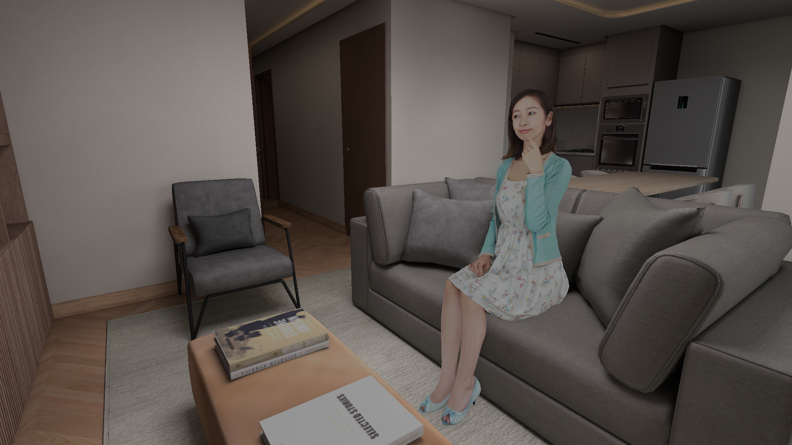
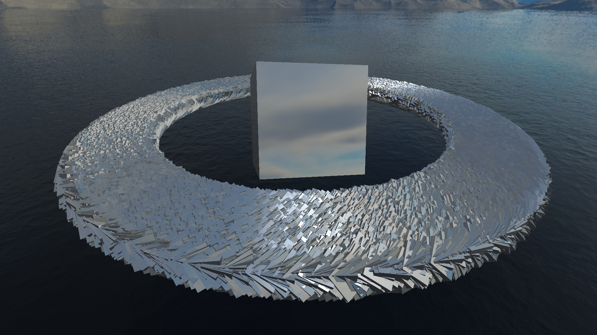
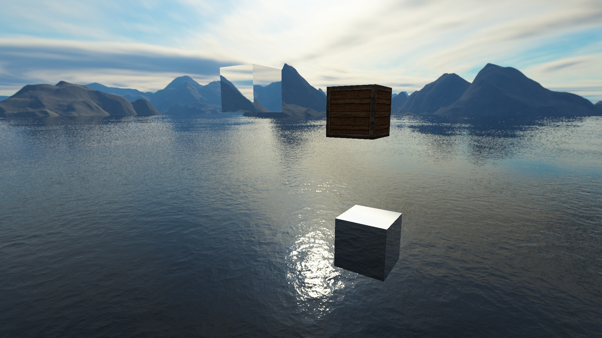
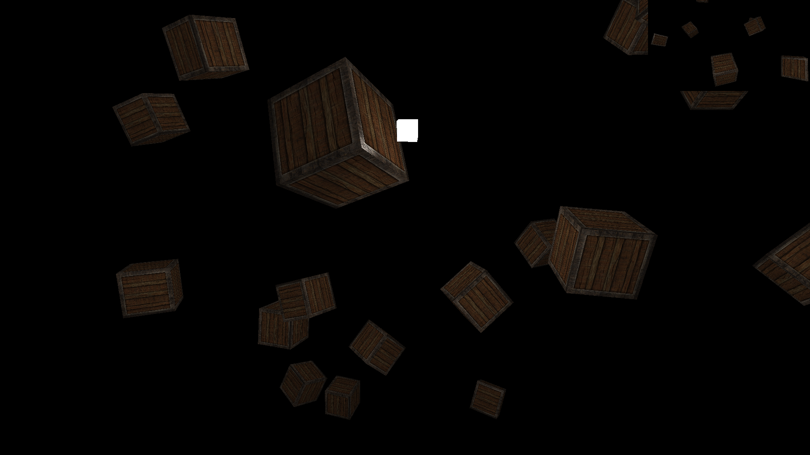
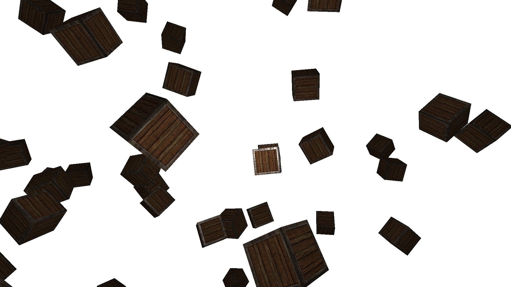
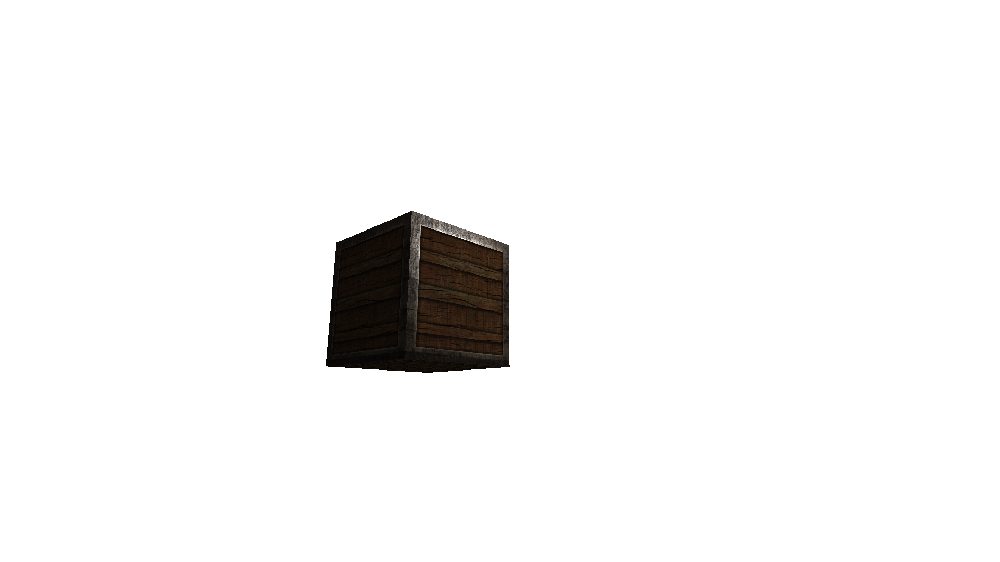
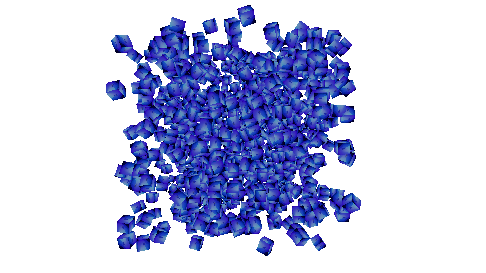

# OpenGLTutorial

## Gallery
<table>
<tr>
<td width="50%" valign="top">
<figure>
    
    <figcaption>
    SSAO: Person sits on a couch in an apartment unit 
    <ul>
        <li>G-buffer with world and view space attachments</li>
        <li>Kernel and blur passes for AO</li>
        <li>Rendering into HDR buffer at end for increased light attenuation precision</li>
        <li>Model loading via Assimp</li>
        <li>Used LearnOpenGL tutorials and Assimp/FastGLTF docs</li>
    </ul>
  </figcaption>
</figure>
</td>
<td width="50%" valign="top">
<figure>
    
    <figcaption>
    Deferred Rendering: 800 point lights, 1600 boxes with Blinn-Phong lighting 
    Frametime &lt;7ms on NVIDIA GeForce RTX 4060 Ti
    <ul>
        <li>G-buffer with pos, norms, and material properties</li>
        <li>Light volume filtering with stencil testing and blending</li>
        <li>Used LearnOpenGL and OGLDev's tutorials</li>
    </ul>
  </figcaption>
</figure>
</td>
</tr>
<tr>
<td width="50%" valign="top">
<figure>
    
    <figcaption>
    Advanced Lighting: 8 point lights revolve above 3 boxes, each casting its own shadows
    <ul>
        <li>Blinn-Phong lighting using SSBOs</li>
        <li>Shadow mapping with depth cubemap stack</li>
        <li>Normal mapping</li>
        <li>HDR, tonemapping</li>
        <li>Used LearnOpenGL tutorials</li>
    </ul>
  </figcaption>
</figure>
</td>
<td width="50%" valign="top">
<figure>
    
    <figcaption>
    Instancing: 150000 reflective boxes orbiting a large reflective box  
    Frametime &lt;7ms on NVIDIA GeForce RTX 4060 Ti
    <ul>
        <li>Instancing</li>
        <li>MSAA</li>
        <li>Used LearnOpenGL tutorials</li>
    </ul>
  </figcaption>
</figure>
</td>
</tr>
<tr>
<td width="50%" valign="top">
<figure>
    
    <figcaption>
    Skybox: A refractive, a diffuse/specular, and a reflective box float in the sky
    <ul>
        <li>Skybox with cubemap</li>
        <li>Reflective and refractive materials</li>
        <li>Used LearnOpenGL tutorials</li>
    </ul>
  </figcaption>
</figure>
</td>
<td width="50%" valign="top">
<figure>
    
    <figcaption>
    Rearview: Boxes rotate near a point light, and a rearview display sits in the top right 
    <ul>
        <li>Framebuffers</li>
        <li>Used LearnOpenGL tutorials</li>
    </ul>
  </figcaption>
</figure>
</td>
</tr>
<tr>
<td width="50%" valign="top">
<figure>
    
    <figcaption>
    MultipleLighting: Boxes rotate near a point light with a spotlight from the camera
    <ul>
        <li>Directional, point, and spot lights</li>
        <li>Used LearnOpenGL tutorials</li>
    </ul>
  </figcaption>
</figure>
</td>
<td width="50%" valign="top">
<figure>
    
    <figcaption>
    SimpleLighting: A box with a diffuse and specular map floats near a light
    <ul>
        <li>Lighting maps</li>
        <li>Materials</li>
        <li>Phong Lighting</li>
        <li>Used LearnOpenGL tutorials</li>
    </ul>
  </figcaption>
</figure>
</td>
</tr>
<tr>
<td width="50%" valign="top">
<figure>
    
    <figcaption>
    GettingStarted: Cubes with textures rotate
    <ul>
        <li>Interactive camera</li>
        <li>Textures</li>
        <li>Shaders</li>
        <li>Triangles and cubes</li>
        <li>OpenGL, GLFW, and GLEW</li>
        <li>Used LearnOpenGL and Cherno's tutorials</li>
    </ul>
  </figcaption>
</figure>
</td>
</tr>
</table>

## Credits
Skybox texture from [KIIRA](https://opengameart.org/content/sky-box-sunny-day) used under [CC-BY 3.0](https://creativecommons.org/licenses/by/3.0/) 
Person model used under the Free3D Personal Use License, download link [here](https://free3d.com/3d-model/091_aya-3dsmax-2020-189298.html) 
Apartment unit model used under the [CC-BY 4.0](https://creativecommons.org/licenses/by/4.0/) license from SrMonteiro, download link [here](https://sketchfab.com/3d-models/appartement-6a7a5fe208344b2e8123a88923dbd5b3) 
Rusted Iron PBR texture from FreePBR, download link [here](https://freepbr.com/product/rusted-iron-pbr-metal-material/) 
Seaview HDR map from Poly Haven, download link [here](https://polyhaven.com/a/relax_inn_seaview_suite)